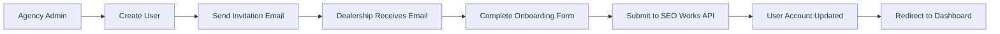
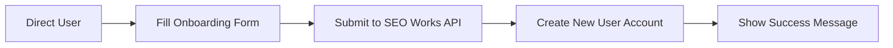

# Agency-to-Dealership Onboarding Workflow

## Overview

This document describes the connected workflow that allows agencies to create dealership users and guide them through proper onboarding with SEO Works integration.

## ✅ Connected Workflow (NEW)

### **Scenario 1: Invitation-Driven Onboarding (Recommended)**



**Step-by-Step Process:**

1. **Agency Admin Creates User**
   - Location: `/admin/agencies/[agencyId]/users`
   - API: `POST /api/admin/agencies/[agencyId]/users`
   - Creates user with `onboardingCompleted: false`

2. **Automatic Invitation Email**
   - Template: `userInvitationTemplate()` in `lib/mailgun/templates.ts`
   - **NEW**: For dealership users (`role: USER` + `agencyId`), email links to onboarding
   - URL: `/onboarding/seoworks?token={userId}&invited=true`

3. **Dealership Completes Onboarding**
   - Component: `DealershipOnboardingForm` detects invitation parameters
   - **NEW**: Shows "Complete Your Dealership Setup" title
   - **NEW**: Includes invitation notice banner

4. **Onboarding Submission**
   - **NEW**: Uses `/api/seoworks/complete-onboarding` for invited users
   - Updates existing user instead of creating duplicate
   - Submits data to SEO Works API
   - Sets `onboardingCompleted: true`
   - Creates initial setup request

5. **Success & Redirect**
   - Shows completion message
   - Automatically redirects to `/dashboard`

### **Scenario 2: Standalone Onboarding (Existing)**



**Step-by-Step Process:**

1. **Direct Access**
   - URL: `/onboarding/seoworks` (no parameters)
   - Shows "Dealer Onboarding" title

2. **Onboarding Submission**
   - Uses `/api/seoworks/send-onboarding` endpoint
   - **UPDATED**: Checks for existing users to prevent duplicates
   - Creates new user account if none exists
   - Submits data to SEO Works API

## 🔧 Technical Implementation

### **Files Modified:**

#### **1. Invitation Email Template** (`lib/mailgun/templates.ts`)
```typescript
// NEW: Detects dealership users and links to onboarding
const isDealershipUser = user.role === 'USER' && user.agencyId
const onboardingUrl = `${appUrl}/onboarding/seoworks?token=${user.id}&invited=true`
const finalLoginUrl = isDealershipUser ? onboardingUrl : signInUrl
```

#### **2. New Complete Onboarding API** (`app/api/seoworks/complete-onboarding/route.ts`)
```typescript
// For invited users - updates existing user
export async function POST(request: NextRequest) {
  const { userId, ...dealerData } = await request.json()
  
  // Find existing user created by agency
  const existingUser = await prisma.user.findUnique({ where: { id: userId }})
  
  // Send to SEO Works API
  await sendToSEOWorks(dealerData)
  
  // Update user with onboarding completion
  await prisma.user.update({
    where: { id: userId },
    data: { onboardingCompleted: true, activePackageType: package }
  })
}
```

#### **3. Updated Onboarding Form** (`components/onboarding/dealership-onboarding-form.tsx`)
```typescript
// NEW: Detect invitation parameters
const searchParams = useSearchParams()
const invitedUserId = searchParams.get('token')
const isInvited = searchParams.get('invited') === 'true'

// NEW: Use different API endpoint
const apiEndpoint = isInvited && invitedUserId 
  ? '/api/seoworks/complete-onboarding' 
  : '/api/seoworks/send-onboarding'
```

#### **4. Updated Standalone API** (`app/api/seoworks/send-onboarding/route.ts`)
```typescript
// NEW: Prevent duplicate user creation
const existingUser = await prisma.user.findUnique({ where: { email }})
if (existingUser) {
  return errorResponse('User already exists. Use invitation link if invited by agency.', 409)
}
```

## 🎯 Key Benefits

### **✅ Connected Workflow**
- **No Duplicate Users**: Invited users update existing accounts instead of creating duplicates
- **Proper Agency Association**: Users maintain connection to their agency
- **Seamless Experience**: Direct email-to-dashboard flow
- **SEO Works Integration**: All users properly submitted to SEO Works API

### **✅ Backward Compatibility**
- **Standalone Onboarding**: Still works for direct users
- **Existing APIs**: No breaking changes to current functionality
- **Agency Management**: Existing user management features preserved

## 🧪 Testing Scenarios

### **Test 1: Agency Creates Dealership User**
1. Sign in as Agency Admin
2. Go to `/admin/agencies/[agencyId]/users`
3. Create new user with role "USER"
4. Verify invitation email sent
5. Check email contains onboarding link with `?token={userId}&invited=true`

### **Test 2: Invited User Completes Onboarding**
1. Click invitation link from email
2. Verify "Complete Your Dealership Setup" title shown
3. Verify invitation banner displayed
4. Complete onboarding form
5. Verify submission goes to `/api/seoworks/complete-onboarding`
6. Verify redirect to dashboard
7. Check user record updated with `onboardingCompleted: true`

### **Test 3: Standalone User Onboarding**
1. Go directly to `/onboarding/seoworks`
2. Verify "Dealer Onboarding" title shown
3. Complete onboarding form
4. Verify submission goes to `/api/seoworks/send-onboarding`
5. Verify new user account created

### **Test 4: Duplicate Prevention**
1. Try standalone onboarding with email of existing user
2. Verify error message about using invitation link

## 🔍 Troubleshooting

### **Common Issues:**

1. **Invitation Link Not Working**
   - Check `userId` parameter in URL
   - Verify user exists in database
   - Check `invited=true` parameter

2. **Wrong API Endpoint Called**
   - Check URL parameters detection in form
   - Verify `isInvited` logic in component

3. **Duplicate User Creation**
   - Check existing user detection in standalone API
   - Verify invitation flow uses complete-onboarding endpoint

4. **SEO Works Integration Failure**
   - Check API key configuration
   - Verify payload format matches expected schema
   - Review server logs for detailed error messages

## 📋 Next Steps

1. **Test Complete Workflow** - End-to-end testing of invitation flow
2. **Monitor SEO Works Integration** - Ensure API submissions are successful
3. **User Feedback** - Gather feedback on new invitation experience
4. **Documentation Updates** - Update user guides for agencies and dealerships